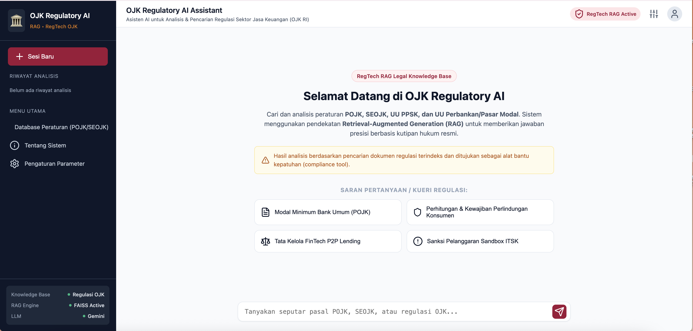

# AI-Assistant-for-OJK-Regulations



## **Latar Belakang**

Dokumen peraturan dan ketentuan yang diterbitkan oleh **Otoritas Jasa Keuangan (OJK)** memuat berbagai informasi penting mengenai regulasi, kewajiban, prosedur, pelaporan, persyaratan, serta ketentuan yang berlaku bagi sektor jasa keuangan. Informasi tersebut umumnya tersebar dalam berbagai dokumen PDF sehingga proses pencarian informasi secara manual dapat membutuhkan waktu yang cukup banyak.

Perkembangan teknologi **Artificial Intelligence (AI)**, khususnya **Large Language Model (LLM)**, membuka peluang untuk membangun sistem yang dapat membantu pengguna mencari dan memahami informasi dari kumpulan dokumen regulasi secara lebih cepat dan interaktif. Namun, penggunaan LLM secara langsung memiliki risiko menghasilkan informasi yang tidak terdapat dalam dokumen sumber atau *hallucination*.

Untuk mengatasi permasalahan tersebut, proyek ini mengembangkan **OJK Regulatory AI Assistant**, yaitu chatbot berbasis **Retrieval-Augmented Generation (RAG)** yang dirancang untuk membantu pengguna mencari dan memahami informasi berdasarkan dokumen resmi Otoritas Jasa Keuangan.

Sistem menggunakan **Sentence Transformer `all-MiniLM-L6-v2`** untuk mengubah pertanyaan pengguna dan potongan dokumen menjadi representasi vektor. Selanjutnya, **FAISS** digunakan untuk melakukan pencarian *semantic similarity* dan menemukan chunk dokumen yang paling relevan dengan pertanyaan pengguna. Informasi hasil retrieval kemudian diberikan sebagai **context** kepada **Gemini** untuk menghasilkan jawaban berdasarkan dokumen yang ditemukan.

Sistem juga mempertahankan metadata seperti **nama file dan nomor halaman**, sehingga sumber informasi yang digunakan dapat ditelusuri kembali ke dokumen asal.

---

## **Business Understanding**

### **Problem Statements**

1. **Pencarian informasi dalam dokumen OJK membutuhkan waktu**

   Dokumen peraturan OJK tersedia dalam berbagai dokumen PDF dengan jumlah halaman yang cukup banyak. Pengguna perlu membaca atau mencari secara manual untuk menemukan ketentuan yang relevan.

2. **Informasi regulasi tersebar pada berbagai dokumen**

   Ketentuan mengenai suatu topik dapat ditemukan pada dokumen OJK yang berbeda. Kondisi ini dapat menyulitkan pengguna dalam menemukan informasi yang dibutuhkan secara cepat.

3. **Pencarian berbasis kata kunci memiliki keterbatasan**

   Pengguna dapat mengajukan pertanyaan dengan bahasa yang berbeda dari teks asli dalam dokumen. Pencarian berbasis kata kunci dapat mengalami kesulitan dalam menemukan informasi yang memiliki makna serupa tetapi menggunakan istilah berbeda.

4. **Penggunaan LLM secara langsung memiliki risiko hallucination**

   LLM dapat menghasilkan jawaban yang terlihat benar tetapi tidak terdapat dalam dokumen regulasi yang menjadi sumber. Oleh karena itu, diperlukan mekanisme retrieval untuk menyediakan context yang relevan kepada model.

5. **Pengguna membutuhkan sumber jawaban**

   Dalam konteks regulasi, pengguna perlu mengetahui dokumen dan halaman yang menjadi dasar jawaban sehingga informasi dapat diperiksa kembali.

---

### **Goals**

1. Mengembangkan **OJK Regulatory AI Assistant** yang dapat membantu pengguna mencari informasi dari dokumen peraturan OJK.

2. Menerapkan pendekatan **Retrieval-Augmented Generation (RAG)** untuk menghubungkan pertanyaan pengguna dengan informasi relevan dari dokumen OJK.

3. Menggunakan **Sentence Transformer `all-MiniLM-L6-v2`** untuk menghasilkan embedding dokumen dan pertanyaan.

4. Menggunakan **FAISS** untuk melakukan pencarian *semantic similarity* terhadap chunk dokumen.

5. Menggunakan **Gemini** sebagai LLM untuk menghasilkan jawaban berdasarkan context hasil retrieval.

6. Menampilkan **sumber dokumen dan nomor halaman** yang digunakan dalam menghasilkan jawaban.

7. Menghasilkan sistem *question answering* yang dapat membantu pengguna memahami informasi regulasi OJK secara lebih cepat dan interaktif.

---

### **Solution Statements**

Untuk mencapai tujuan tersebut, dikembangkan **OJK Regulatory AI Assistant**, sebuah chatbot berbasis RAG dengan alur:

```text
Dokumen Peraturan OJK
        ↓
Preprocessing & Chunking
        ↓
Sentence Transformer
        ↓
Embedding Dokumen
        ↓
FAISS Vector Index
        ↓
      User Query
        ↓
    Query Embedding
        ↓
  FAISS Similarity Search
        ↓
 Top-K Relevant Chunks
        ↓
      Context
        ↓
      Gemini
        ↓
 Jawaban + Sumber
```

Solusi yang diterapkan terdiri dari beberapa komponen utama:

* **Semantic Retrieval** — menggunakan Sentence Transformer dan FAISS untuk mencari informasi berdasarkan kemiripan makna.

* **Context Augmentation** — hasil retrieval digunakan sebagai context sebelum diberikan kepada Gemini.

* **Grounded Generation** — Gemini diarahkan untuk menghasilkan jawaban berdasarkan context yang diberikan.

* **Source Citation** — sistem mempertahankan informasi nama file dan halaman sebagai sumber jawaban.

* **Interactive Chatbot** — pengguna dapat mengajukan pertanyaan menggunakan bahasa natural.

* **FastAPI Backend** — digunakan untuk menyediakan API yang menghubungkan sistem RAG dengan antarmuka chatbot.

Dengan pendekatan tersebut, sistem tidak hanya berfungsi sebagai chatbot, tetapi juga sebagai sistem pencarian dan *question answering* berbasis dokumen regulasi OJK.

---

# **Data Understanding**

## **Sumber Data**

Dataset yang digunakan dalam proyek ini berupa kumpulan dokumen **peraturan dan ketentuan Otoritas Jasa Keuangan (OJK)** dalam format PDF.

Dokumen digunakan sebagai **Knowledge Base** untuk sistem Retrieval-Augmented Generation.

Salah satu contoh dokumen yang digunakan dalam pengujian adalah:

```text
SE OJK Nomor 2 Tahun 2020.pdf
SE OJK Nomor 10 Tahun 2020.pdf
SE OJK Nomor 11 Tahun 2020.pdf
SE OJK Nomor 13 Tahun 2020.pdf
```

Dokumen-dokumen tersebut digunakan sebagai sumber informasi dalam proses retrieval.

---

## **Deskripsi Dataset**

Dataset terdiri dari kumpulan dokumen regulasi OJK dalam format **PDF**.

Informasi yang terdapat dalam dokumen dapat mencakup:

* Nomor dan tahun peraturan
* Judul peraturan
* Ketentuan
* Persyaratan
* Kewajiban
* Larangan
* Prosedur
* Pelaporan
* Penilaian
* Sanksi apabila tersedia
* Ketentuan lainnya yang terdapat dalam dokumen

Dokumen PDF terlebih dahulu melalui proses **ekstraksi teks, preprocessing, dan chunking** sebelum digunakan dalam sistem RAG.

Setiap chunk kemudian diubah menjadi representasi vektor menggunakan:

```text
sentence-transformers/all-MiniLM-L6-v2
```

Embedding kemudian disimpan dalam FAISS, sedangkan teks dan metadata disimpan untuk digunakan kembali pada proses retrieval.

---

## **Kondisi Data**

Data yang digunakan dalam sistem memiliki struktur:

| Komponen        | Keterangan                        |
| --------------- | --------------------------------- |
| Dokumen         | Peraturan dan ketentuan OJK       |
| Format awal     | PDF                               |
| Teks            | Hasil ekstraksi dokumen           |
| Chunk           | Potongan teks untuk retrieval     |
| Embedding       | Representasi vektor setiap chunk  |
| Vector database | FAISS                             |
| Metadata        | ID, source, page, dan chunk index |
| Model embedding | `all-MiniLM-L6-v2`                |

Contoh metadata:

```python
{
    "source": "SE OJK Nomor 11 Tahun 2020.pdf",
    "page": 60,
    "chunk_index": 124,
    "document_type": "PNPK"
}
```

Metadata digunakan agar sistem dapat mengidentifikasi kembali dokumen dan halaman sumber dari setiap chunk yang ditemukan.

---

## **Distribusi Data**

Proyek ini merupakan sistem **Question Answering berbasis RAG**, sehingga tidak menggunakan distribusi kelas seperti pada permasalahan klasifikasi.

Analisis dataset lebih relevan dilakukan berdasarkan:

1. Jumlah dokumen
2. Jumlah halaman
3. Jumlah chunk
4. Jumlah vector
5. Jenis dokumen
6. Distribusi chunk berdasarkan dokumen

---

## **Potensi Tantangan**

Beberapa tantangan dalam pengembangan sistem antara lain:

1. **Struktur PDF yang beragam**

   Dokumen regulasi dapat memiliki struktur dan format halaman yang berbeda.

2. **Kualitas ekstraksi teks**

   Hasil ekstraksi PDF dapat mengandung spasi, karakter, atau susunan teks yang tidak sempurna.

3. **Chunking**

   Chunk yang terlalu kecil dapat kehilangan konteks, sedangkan chunk yang terlalu besar dapat memasukkan informasi yang tidak relevan.

4. **Kemiripan antar dokumen**

   Beberapa dokumen OJK dapat menggunakan istilah yang sama sehingga retrieval perlu membedakan konteks dokumen.

5. **Pertanyaan natural language**

   Pengguna dapat menggunakan istilah yang berbeda dengan teks asli regulasi.

6. **Retrieval yang kurang relevan**

   FAISS dapat mengambil chunk yang memiliki kemiripan semantik tetapi tidak benar-benar menjawab pertanyaan.

7. **Hallucination**

   Gemini harus diarahkan agar tidak menambahkan informasi yang tidak terdapat dalam context.

8. **Keterlacakan sumber**

   Metadata seperti nama file dan halaman harus dipertahankan agar jawaban dapat diverifikasi.

---

# **Data Preprocessing**

Tahap preprocessing dilakukan untuk mengubah dokumen PDF OJK menjadi data teks yang siap digunakan dalam sistem RAG.

Secara umum:

```text
PDF OJK
   ↓
Ekstraksi Teks
   ↓
Cleaning
   ↓
Chunking
   ↓
Metadata
   ↓
Embedding
   ↓
FAISS Index
```

## **1. Pengumpulan Dokumen**

Dokumen regulasi OJK dikumpulkan dan disimpan dalam format PDF untuk digunakan sebagai Knowledge Base.

---

## **2. Ekstraksi Teks**

Teks diekstraksi dari setiap halaman dokumen.

Nomor halaman dipertahankan karena digunakan sebagai metadata sumber.

Contoh:

```text
Document:
SE OJK Nomor 11 Tahun 2020.pdf

Page:
60

Text:
... menyampaikan laporan pelaksanaan tugas dan tanggung jawab secara berkala ...
```

---

## **3. Cleaning dan Normalisasi**

Teks hasil ekstraksi dibersihkan untuk mengurangi noise.

Proses dapat meliputi:

* Menghapus whitespace berlebihan
* Membersihkan karakter yang tidak diperlukan
* Menormalisasi spasi
* Menggabungkan teks yang terpotong
* Mempertahankan informasi penting seperti pasal dan ketentuan
* Membersihkan noise akibat ekstraksi PDF

---

## **4. Chunking**

Dokumen kemudian dibagi menjadi beberapa potongan teks atau **chunk**.

Chunk digunakan sebagai unit retrieval.

```text
Dokumen PDF
     ↓
Halaman
     ↓
Chunk 1
Chunk 2
Chunk 3
     ↓
Halaman berikutnya
     ↓
Chunk berikutnya
```

Setiap chunk tetap memiliki hubungan dengan dokumen dan halaman asal.

---

## **5. Metadata**

Metadata disimpan bersama setiap chunk.

Contoh:

```python
{
    "source": "SE OJK Nomor 11 Tahun 2020.pdf",
    "page": 60,
    "chunk_index": 124
}
```

Metadata digunakan untuk menampilkan sumber informasi kepada pengguna.

---

## **6. Embedding**

Setiap chunk dikonversi menjadi vector menggunakan:

```text
sentence-transformers/all-MiniLM-L6-v2
```

Model yang sama digunakan untuk membuat embedding query pengguna.

---

## **7. Normalisasi Embedding**

Embedding dinormalisasi sebelum digunakan dalam proses pencarian similarity.

```python
embedding_model.encode(
    texts,
    convert_to_numpy=True,
    normalize_embeddings=True
)
```

---

## **8. Penyimpanan FAISS**

Embedding disimpan dalam FAISS index.

Struktur penyimpanan:

```text
Vector
   ↓
FAISS Index
   ↓
Document ID
   ↓
Text
   ↓
Metadata
```

FAISS kemudian digunakan untuk mencari chunk yang memiliki similarity paling tinggi dengan query pengguna.

---

## **9. Hasil Akhir Preprocessing**

Struktur vector store:

```text
vectorstore/

├── index.faiss
├── doc_ids.pkl
├── texts.pkl
└── metadata.pkl
```

| File           | Fungsi                     |
| -------------- | -------------------------- |
| `index.faiss`  | Menyimpan vector embedding |
| `doc_ids.pkl`  | Menyimpan ID setiap chunk  |
| `texts.pkl`    | Menyimpan teks chunk       |
| `metadata.pkl` | Menyimpan metadata dokumen |

---

# **Modeling**

Tahap modeling terdiri dari tiga komponen utama:

1. **Sentence Transformer**
2. **FAISS**
3. **Gemini**

Arsitektur:

```text
                  USER QUESTION
                       │
                       ▼
             ┌─────────────────────┐
             │ Sentence Transformer│
             │ all-MiniLM-L6-v2    │
             └──────────┬──────────┘
                        │
                        ▼
                 Query Embedding
                        │
                        ▼
             ┌─────────────────────┐
             │        FAISS        │
             │  Similarity Search  │
             └──────────┬──────────┘
                        │
                        ▼
                  Top-K Chunks
                        │
                        ▼
                     Context
                        │
                        ▼
             ┌─────────────────────┐
             │       Gemini        │
             │        LLM          │
             └──────────┬──────────┘
                        │
                        ▼
                Generated Answer
                        │
                        ▼
                 Answer + Sources
```

---

## **1. Embedding Model**

Embedding menggunakan:

```text
sentence-transformers/all-MiniLM-L6-v2
```

Model digunakan untuk mengubah dokumen dan query menjadi representasi vector.

```python
embedding_model = SentenceTransformer(
    "sentence-transformers/all-MiniLM-L6-v2",
    device="cpu"
)
```

---

## **2. FAISS**

FAISS digunakan untuk melakukan pencarian *semantic similarity*.

Query diubah menjadi embedding kemudian dibandingkan dengan vector yang terdapat dalam FAISS.

```python
scores, indices = index.search(
    query_embedding,
    top_k
)
```

Pada tahap retrieval, sistem mengambil beberapa chunk dengan similarity tertinggi.

Contoh:

```text
Query
 ↓
Query Embedding
 ↓
FAISS
 ↓
Rank 1
Rank 2
Rank 3
Rank 4
Rank 5
```

---

## **3. Large Language Model**

Model generatif yang digunakan adalah:

```text
Gemini
```

Gemini menerima:

1. Pertanyaan pengguna
2. Context hasil retrieval FAISS

Kemudian menghasilkan jawaban berdasarkan context.

Prompt yang digunakan secara sederhana:

```text
Berikut adalah potongan dokumen Otoritas Jasa Keuangan (OJK)
yang relevan.

Jawablah dengan lengkap dan akurat berdasarkan konteks di atas.
Jangan menggunakan informasi di luar konteks.
Cantumkan sumber file dan halaman jika relevan.
```

---

## **4. RAG Pipeline**

Pipeline sistem:

### Tahap 1 — Query

Pengguna memberikan pertanyaan.

Contoh:

```text
Apa kewajiban pelaporan kepada Otoritas Jasa Keuangan?
```

### Tahap 2 — Query Embedding

Pertanyaan dikonversi menjadi vector menggunakan:

```text
all-MiniLM-L6-v2
```

### Tahap 3 — Retrieval

FAISS mencari chunk yang memiliki similarity paling tinggi.

### Tahap 4 — Context Construction

Chunk hasil retrieval digabungkan menjadi context.

```text
[Sumber 1]
Dokumen: SE OJK Nomor 11 Tahun 2020.pdf
Halaman: 60

Isi dokumen...

[Sumber 2]
Dokumen: ...
Halaman: ...

Isi dokumen...
```

### Tahap 5 — Generation

Context dan pertanyaan diberikan kepada Gemini.

### Tahap 6 — Response

Sistem menghasilkan:

```text
Jawaban
+
Sumber dokumen
+
Nomor halaman
```

---

## **5. Model yang Digunakan**

| Komponen       | Teknologi          | Fungsi                       |
| -------------- | ------------------ | ---------------------------- |
| Embedding      | `all-MiniLM-L6-v2` | Mengubah teks menjadi vector |
| Vector Search  | FAISS              | Mencari chunk relevan        |
| LLM            | Gemini             | Menghasilkan jawaban         |
| Backend        | FastAPI            | Menyediakan API RAG          |
| Knowledge Base | Dokumen OJK        | Sumber informasi             |

---

# **Evaluation**

Evaluasi sistem dilakukan untuk mengetahui kemampuan **retrieval** dalam menemukan dokumen yang relevan terhadap pertanyaan pengguna.

Evaluasi retrieval dapat menggunakan:

* **Recall@1**
* **Recall@3**
* **Recall@5**

Dataset evaluasi menggunakan pasangan:

```python
{
    "question": "...",
    "expected_source": "..."
}
```

Contoh:

```python
evaluation_data = [
    {
        "question": "Apa kewajiban pelaporan kepada Otoritas Jasa Keuangan?",
        "expected_source": "SE%20OJK%20Nomor%2011%20Tahun%202020.pdf"
    },

    {
        "question": "Bagaimana ketentuan penyampaian laporan kepada Otoritas Jasa Keuangan?",
        "expected_source": "SE%20OJK%20Nomor%2011%20Tahun%202020.pdf"
    },

    {
        "question": "Apa hasil penilaian kemampuan dan kepatutan yang ditetapkan oleh Otoritas Jasa Keuangan?",
        "expected_source": "SE%20OJK%20Nomor%202%20Tahun%202020.pdf"
    }
]
```

---

## **Retrieval Evaluation**

Evaluasi dilakukan dengan membandingkan `expected_source` dengan source yang ditemukan oleh FAISS.

```text
Query
 ↓
FAISS
 ↓
Top-1 / Top-3 / Top-5
 ↓
Compare dengan Expected Source
 ↓
Recall@K
```

Interpretasi:

* **Recall@1** menunjukkan apakah dokumen target berada di peringkat pertama.
* **Recall@3** menunjukkan apakah dokumen target ditemukan dalam tiga hasil teratas.
* **Recall@5** menunjukkan apakah dokumen target ditemukan dalam lima hasil teratas.

---

## **Contoh Hasil Retrieval**

Contoh pengujian:

```text
Query:
Apa ketentuan mengenai pengisian jabatan Gubernur dan Wakil Gubernur
Daerah Istimewa Yogyakarta?
```

menunjukkan bahwa FAISS dapat menemukan dokumen yang relevan dengan similarity score yang tinggi.

Untuk project OJK, evaluasi dilakukan dengan prinsip yang sama menggunakan dokumen regulasi OJK sebagai ground truth.

**Nilai Recall aktual sebaiknya diisi berdasarkan hasil evaluasi terbaru setelah seluruh dataset evaluasi dijalankan.**

---

# **Hasil**

Sistem berhasil mengimplementasikan pipeline:

```text
PDF OJK
   ↓
Preprocessing
   ↓
Chunking
   ↓
Embedding
   ↓
FAISS
   ↓
Query Retrieval
   ↓
Context
   ↓
Gemini
   ↓
Jawaban + Sumber
```

Contoh retrieval pada query:

```text
Apa kewajiban pelaporan kepada Otoritas Jasa Keuangan?
```

menghasilkan chunk yang relevan seperti:

```text
Score : 0.7333

Source:
SE OJK Nomor 11 Tahun 2020.pdf

Page:
60

Text:
... menyampaikan laporan pelaksanaan tugas dan tanggung
jawab secara berkala kepada Otoritas Jasa Keuangan ...
```

Hasil tersebut menunjukkan bahwa sistem dapat menemukan informasi yang berkaitan dengan kewajiban pelaporan kepada OJK.

Namun, beberapa hasil dengan similarity score tinggi masih dapat memiliki relevansi yang lebih rendah terhadap pertanyaan. Oleh karena itu, peningkatan kualitas retrieval dapat dilakukan melalui **reranking** atau optimasi chunking dan metadata filtering.

---

# **Kesimpulan**

Proyek **OJK Regulatory AI Assistant** berhasil mengimplementasikan sistem **Retrieval-Augmented Generation (RAG)** untuk membantu pengguna mencari dan memahami informasi berdasarkan dokumen regulasi Otoritas Jasa Keuangan.

Sistem menggunakan **Sentence Transformer `all-MiniLM-L6-v2`** untuk menghasilkan embedding dokumen dan pertanyaan. Selanjutnya, **FAISS** digunakan untuk melakukan pencarian semantic similarity dan menemukan chunk yang relevan. Hasil retrieval kemudian diberikan sebagai context kepada **Gemini** untuk menghasilkan jawaban.

Sistem juga mempertahankan metadata berupa **nama file, nomor halaman, dan informasi chunk**, sehingga sumber informasi dapat ditelusuri kembali.

Hasil pengujian menunjukkan bahwa retrieval mampu menemukan dokumen yang relevan untuk beberapa pertanyaan regulasi OJK. Namun, similarity score yang tinggi tidak selalu menjamin bahwa seluruh chunk benar-benar relevan dengan pertanyaan.

Oleh karena itu, pengembangan selanjutnya dapat dilakukan dengan:

1. Menambah jumlah dataset evaluasi.
2. Meningkatkan kualitas chunking.
3. Menambahkan **reranker** setelah FAISS.
4. Meningkatkan filtering berdasarkan metadata dokumen.
5. Mengoptimalkan prompt Gemini.
6. Menguji Recall@1, Recall@3, dan Recall@5 pada dataset yang lebih besar.
7. Melakukan evaluasi kualitas jawaban Gemini berdasarkan context.
8. Meningkatkan fitur source citation agar pengguna dapat memverifikasi informasi secara langsung.

Secara keseluruhan, proyek ini menunjukkan bahwa kombinasi **Sentence Transformer → FAISS → Gemini** dapat digunakan sebagai dasar untuk membangun sistem *question answering* berbasis dokumen regulasi OJK yang lebih cepat, interaktif, dan dapat ditelusuri sumbernya.
